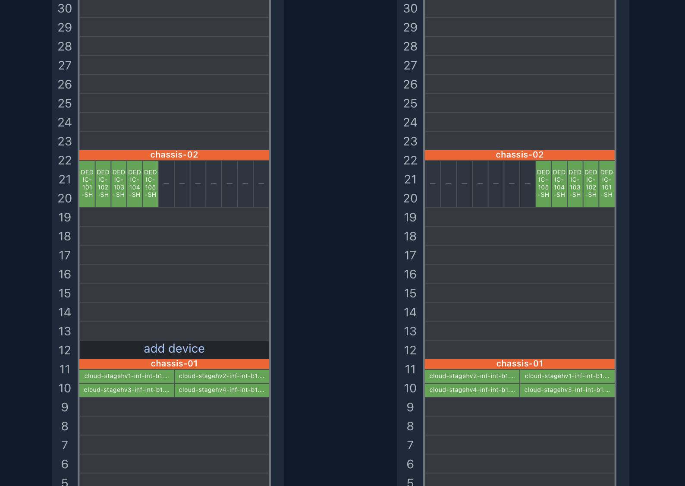

# NetBox Blade Chassis Plugin

NetBox plugin that renders blade server bays inside chassis devices in rack SVG elevations.

## Features

- Configure bay grid coordinates (`position_x`, `position_y`) on **Device Bay Template** forms or the **Blade Layout** tab on Device Type
- Empty coordinates: bay is not shown in rack elevation
- Filled coordinates: bay is rendered as a blade cell with child device hostname
- Symmetric grid validation on bulk save (Blade Layout tab)
- Inline rack elevation via plugin SVG endpoint
- Clickable blade cells linking to child devices

## Screenshot

Rack elevation with blade chassis devices. Child devices are rendered inside the parent chassis grid; cells link to the installed device.



## Compatibility

| NetBox Version | Plugin Version |
|----------------|----------------|
| 4.6            | 0.1.x          |

## Installing

Review [official NetBox plugin documentation](https://docs.netbox.dev/en/stable/plugins/#installing-plugins) for installation instructions.

Install from PyPI. Activate NetBox's virtual environment first:

```bash
source /opt/netbox/venv/bin/activate
pip install netbox-blade-chassis
```

For NetBox Docker, see [using netbox-docker with plugins](https://github.com/netbox-community/netbox-docker/wiki/Using-Netbox-Plugins).

Install a development version directly from GitHub:

```bash
pip install https://github.com/aredoff/netbox-blade-chassis/archive/main.tar.gz
```

Or add to `local_requirements.txt` or `plugin_requirements.txt` (netbox-docker):

```
https://github.com/aredoff/netbox-blade-chassis/archive/main.tar.gz
```

Enable the plugin in `/opt/netbox/netbox/netbox/configuration.py`, or in netbox-docker `/configuration/plugins.py`:

```python
PLUGINS = [
    'netbox_blade_chassis',
]

PLUGINS_CONFIG = {
    'netbox_blade_chassis': {},
}
```

Apply database migrations and update the search index:

```bash
cd /opt/netbox/netbox/
python3 manage.py migrate
python3 manage.py reindex --lazy
```

If you use netbox-docker, migrations and index updates are applied automatically when containers start.

### Settings

| Setting | Default | Description |
|---------|---------|-------------|
| `enable_inline_elevation` | `True` | Inject inline rack elevation SVG via plugin endpoint |

Example:

```python
PLUGINS_CONFIG = {
    'netbox_blade_chassis': {
        'enable_inline_elevation': True,
    },
}
```
